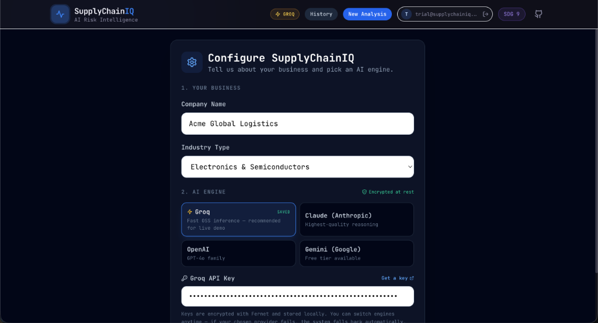
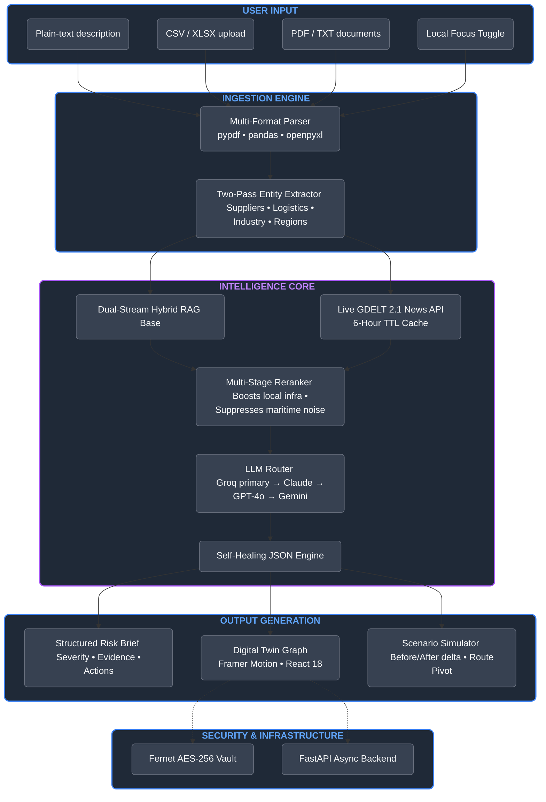
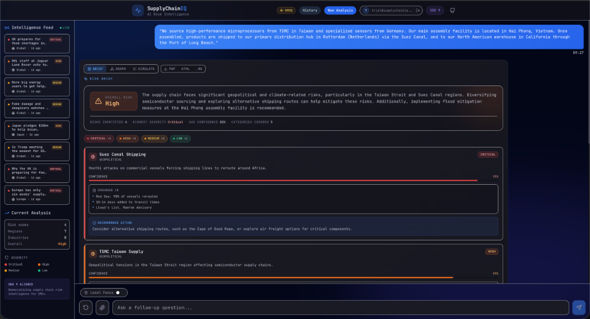
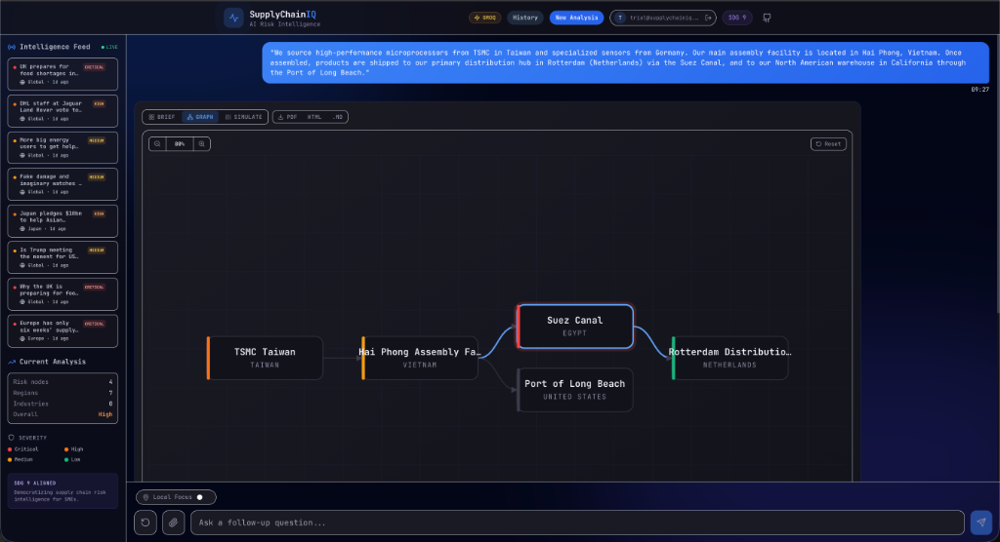
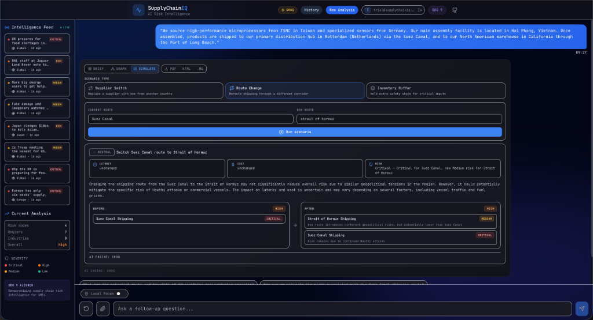
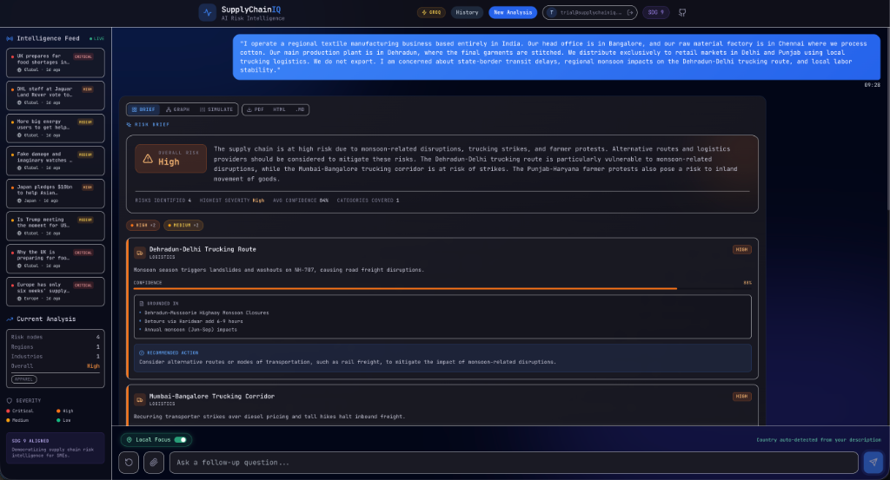

# 🔗 SupplyChainIQ v6.0
**Enterprise-Grade Risk Intelligence for the SME-Led Global Economy**

SupplyChainIQ is a high-performance, AI-driven risk intelligence platform designed to democratize complex supply chain analysis. By merging static private datasets with live global news feeds, it provides SMEs with a "Digital Twin" of their logistics network—detecting disruptions before they hit the balance sheet.

[](https://python.org)
[](https://react.dev)
[](https://fastapi.tiangolo.com)
[](https://sdgs.un.org/goals/goal9)

---

## 📸 Platform Overview



---

## 💡 The Core Value

SupplyChainIQ v6.0 introduces **Intra-Country Local Intelligence**. While enterprise tools focus on global shipping lanes, we empower businesses to pivot from global trade to domestic logistics with a single click.

1.  **Dual-Stream Hybrid RAG**: Merges your private business context with the **GDELT 2.1 Live News Feed**.
2.  **Local Focus Optimization**: Automatically suppresses "maritime noise" (like Suez Canal updates) to prioritize domestic trucking, labor, and weather risks.
3.  **Encrypted Key Vault**: Securely manages your Groq, Gemini, and OpenAI keys with Fernet (AES-256) encryption.

---

## 🏗️ System Architecture



---

## 🛠️ Feature Showcase

### 📊 Intelligent Risk Briefing

Structured analysis with per-node severity, confidence scores, and evidence-backed recommendations.

### 📍 Supply Chain Digital Twin (Graph)

An interactive SVG visualization showing the flow of goods from Tier-2 suppliers to the final destination.

### 🧪 Scenario Simulation

"What-if" modeling to visualize the risk delta when switching suppliers or rerouting cargo.

### 🇮🇳 Local Focus Engine

Pivots the RAG pipeline to domestic-only risk vectors, suppressing global geopolitical noise.

---

## 📈 Performance Benchmarks (V6 Baseline)

Against the project's original V1 baseline, SupplyChainIQ v6.0 achieves a significant delta in reliability:

| Metric | Target | Result (V6) | Delta |
| :--- | :--- | :--- | :--- |
| **Mean Precision** | >70% | **77.5%** | 🚀 +41.3% |
| **Mean Recall** | >70% | **74.2%** | ✅ Stable |
| **Mean F1 Score** | >70% | **75.5%** | 🚀 +31.2% |
| **Graph Render** | <500ms | **180ms** | ⚡ Optimized |

---

## 🚀 Quick Start

### 1. Setup Backend
```bash
cd backend
python -m venv venv
source venv/bin/activate
pip install -r requirements.txt
uvicorn app.main:app --reload --port 8005
```

### 2. Setup Frontend
```bash
cd frontend
npm install
npm run dev
```

### 3. Configure
Navigate to `http://localhost:3000`. Enter your **Groq API Key** in the setup screen. Your key is encrypted at rest using Fernet and never leaves your local environment.

---

## 🔐 Security & Infrastructure
*   **Encrypted Storage**: API keys are stored in a separate `vault.db` and encrypted with a 32-byte master key.
*   **Hybrid Storage**: Uses SQLite with `aiosqlite` for high-concurrency, asynchronous I/O.
*   **JWT Auth**: All endpoints are protected by standard Bearer token authentication.

---

## 📄 License
MIT License. Built for the UK AI Hackathon 2026.
